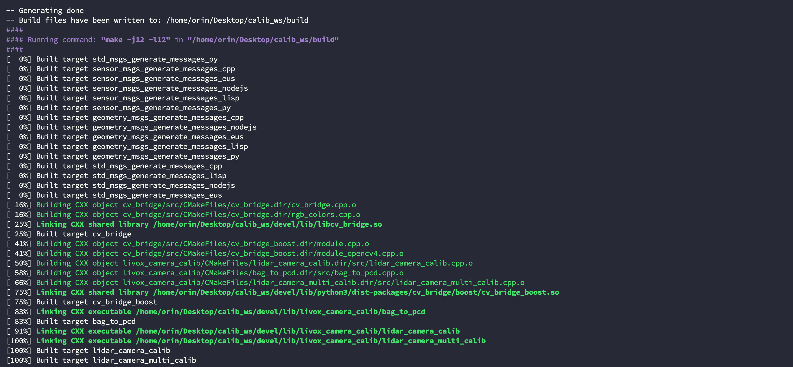
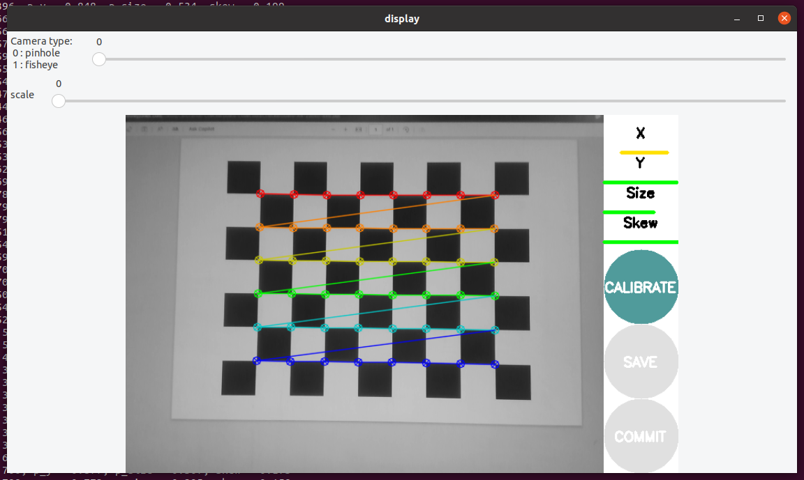

# Lidar Camera Calibration

这个仓库用来实现在 Nvidia Jetson 设备上使用 livox_camra_calib 库对 Mid360 激光雷达与 Realsense D435i 相机外参标定。涉及到的原始仓库如下：

* livox_camera_calib: [https://github.com/hku-mars/livox_camera_calib#](https://github.com/hku-mars/livox_camera_calib#)
* livox_ros_driver2: [https://github.com/Livox-SDK/livox_ros_driver2.git](https://github.com/Livox-SDK/livox_ros_driver2.git)
* realsense_ros: [https://github.com/IntelRealSense/realsense-ros.git](https://github.com/IntelRealSense/realsense-ros.git)
* vision_opencv: [https://github.com/ros-perception/vision_opencv/tree/noetic#](https://github.com/ros-perception/vision_opencv/tree/noetic#)


由于在 Arm 架构上编译需要做一些改动，这个仓库中的源码删除了原先仓库中的 `.git` 文件，目的是为了能拉取后立即使用。该 ReadMe 文件将在第三章节告知修改了源码中的哪些部分。

----

# 1. 确认软硬件

我们在以下软硬件设备上展开了实验，如何你的软硬件环境与我们的不一致，那么建议跟随该 ReadMe 文件进行修改，并将与自己版本相关的部分进行替换。


【注意】：如果你的设备是 Jetson 系列且使用了 Noetic 则几乎不用改动；

|Device|OS|ROS|
|---|----|---|
|Nvidia Jetson Orin DK|Ubuntu 20.04|Noetic|

更多设备的支持将在我们测试完成后添加。

----

# 2. 安装依赖库

根据 [livox_camera_calib](https://github.com/hku-mars/livox_camera_calib) 库的要求，你需要安装以下依赖库：

## 2.1 ROS 依赖
```bash
$ sudo apt-get install ros-$ROS_DISTRO-cv-bridge ros-$ROS_DISTRO-pcl-conversions
```
## 2.2 其他依赖
其他依赖安装可以直接参考他们提供的安装链接，但我发现如果直接用下面的命令安装 Eigen 和 PCL 也没有问题，只有 Ceres 需要源码安装：

```bash
$ sudo apt-get install libeigen3-dev libpcl-dev
```

* Eigen：[http://eigen.tuxfamily.org/index.php?title=Main_Page](http://eigen.tuxfamily.org/index.php?title=Main_Page)；
* Ceres：[http://ceres-solver.org/installation.html](http://ceres-solver.org/installation.html)；
* PCL：[http://www.pointclouds.org/downloads/linux.html](http://www.pointclouds.org/downloads/linux.html)

---

# 3. 拉取源码并编译

由于需要编译 OpenCV 4.2.0 版本源码，并且需要用到 Livox 与 Realsense 的 ROS 驱动，我们将这个仓库的组织形式作为一个完成的工程，并以 git submodules 方式添加了所需的第三方仓库。

## 3.1 拉取源码

需要注意的是，你不应该在一个现有的 ros 工作空间的 `src` 目录下拉取这个仓库，而是应该将这个仓库作为一个单独的工程，如果后期需要进行合并，那么你可能需要自行解决一些同名包的冲突问题。

```bash
$ git clone https://github.com/GaohaoZhou-ops/Lidar-Camera-Calibration.git
```

在拉取完源码后你需要额外修改一处位置：


### 方式二：逐个拉取源码并修改

## 3.1 拉取 livox_camera_calib 源码
创建一个工作空间 `calib_ws` 拉取源码：

```bash
$ mkdir -p calib_ws/src
$ cd calib_ws/src
$ git clone https://github.com/hku-mars/livox_camera_calib.git
```
## 3.2 拉取 cv_bridge 源码
回到工作空间  `calib_ws` 拉取源码，但不要着急放在 `src` 目录下，我们只需要这个仓库中的 `cv_bridge` 部分：

```bash
$ cd calib_ws
$ git clone https://github.com/ros-perception/vision_opencv.git
$ cd vision_opencv
$ git checkout noetic		# 根据自己ROS版本实际情况切换分支
```

切换到正确的分支后将 `cv_bridge` 文件夹拷贝到 `calib_ws/src` 目录下

```bash
$ cd calib_ws
$ cp -r calib_ws/vision_opencv/cv_bridge calib_ws/src
```

## 3.3 修改源码
这里需要修改多处源码，修改顺序可以不同，有关如何在 Jetson 编译 CUDA 加速的 OpenCV 库可以参考我的那篇刷机博客中对应内容（但要注意需要编译 4.2.0 版本）或者这篇 Githuh 仓库 [ReadMe](https://github.com/GaohaoZhou-ops/JetsonSLAM/blob/main/fast_livo2_project/resources/ReadMe-CN.md) 文件中的 `"Step3. 编译 OpenCV 4.2.0"` 小节，但一定要注意：<font color=red>**编译完成后不能 sudo make install**</font>。

经过实验发现 <font color=red>**OpenCV 4.5.4**</font> 无法使用，<font color=green>**OpenCV 4.2.0**</font> 版本可以使用。

* `src/livox_camera_calib/CMakeLists.txt`：


```cmake
# 1. 设置 OpenCV 4.2.0 路径
set(OpenCV_DIR "/home/orin/Desktop/JetsonSLAM/third_party/opencv-4.2.0/build")	
# 2. 添加CUDA工具库
find_package(CUDAToolkit REQUIRED)			

find_package(PCL REQUIRED)
# 3. 明确 OpenCV 版本
find_package(OpenCV 4.2.0 REQUIRED)			# find_package(OpenCV) 
find_package(Threads)
# 4. 明确 Ceres 版本
find_package(Ceres 2.2 REQUIRED)			# find_package(Ceres REQUIRED)	
```


* `src/cv_bridge/CMakeLists.txt`：
```cmake
set(OpenCV_DIR "/home/orin/Desktop/JetsonSLAM/third_party/opencv-4.2.0/build")
find_package(OpenCV 4.2.0 QUIET)
# set(_opencv_version 4)
# find_package(OpenCV 4 QUIET)
```

* `src/livox_camera_calib/src/lidar_camera_calib.cpp`
```cpp
// ceres::LocalParameterization *q_parameterization = 
//			new ceres::EigenQuaternionParameterization();
ceres::Manifold *q_parameterization = new ceres::EigenQuaternionManifold();
```

* `src/livox_camera_calib/src/lidar_camera_multi_calib.cpp`
```cpp
// ceres::LocalParameterization *q_parameterization = 
//			new ceres::EigenQuaternionParameterization();
ceres::Manifold *q_parameterization = new ceres::EigenQuaternionManifold();
```

## 3.4 编译工程
修改完上面的源码内容后就可以编译整个工程了，如果你已经激活了 conda 环境并且没有做额外配置，那么建议先退出 conda 环境。

```bash
$ conda deactivate
$ cd calib_ws
$ catkin_make
```



如果你没有按照上面的步骤执行，特别是有关 OpenCV 部分的操作，那么有可能出现下面的警告，但这个警告不能忽略，否则程序一启动就会崩溃：

```bash
/usr/bin/ld: warning: libopencv_features2d.so.4.5, needed by /home/orin/opencv-4.5.4/build/lib/libopencv_calib3d.so.4.5.4, may conflict with libopencv_features2d.so.4.2
/usr/bin/ld: warning: libopencv_imgproc.so.4.2, needed by /home/orin/Desktop/calib_ws/libopencv_features2d.so.4.2, may conflict with libopencv_imgproc.so.4.5
/usr/bin/ld: warning: libopencv_core.so.4.2, needed by /home/orin/Desktop/calib_ws/libopencv_features2d.so.4.2, may conflict with libopencv_core.so.4.5
[100%] Built target lidar_camera_calib
/usr/bin/ld: warning: libopencv_features2d.so.4.5, needed by /home/orin/opencv-4.5.4/build/lib/libopencv_calib3d.so.4.5.4, may conflict with libopencv_features2d.so.4.2
/usr/bin/ld: warning: libopencv_imgproc.so.4.2, needed by /home/orin/Desktop/calib_ws/libopencv_features2d.so.4.2, may conflict with libopencv_imgproc.so.4.5
/usr/bin/ld: warning: libopencv_core.so.4.2, needed by /home/orin/Desktop/calib_ws/libopencv_features2d.so.4.2, may conflict with libopencv_core.so.4.5
```


----

# 4. 配置工程
这部分也需要对源码进行一些修改，但不涉及编译操作，建议在正式跑自己的需求之前先跑通官方提供的 demo，相关资源链接如下：

* 官方demo数据：[https://pan.baidu.com/s/1oz3unqsmDnFvBExY5fiBJQ?pwd=i964](https://pan.baidu.com/s/1oz3unqsmDnFvBExY5fiBJQ?pwd=i964)

## 4.1 相机内参获取
相机内参数会在后面标定过程中频繁用到，获取相机内参也是非常基础的操作，这边提供了两种获取方式。

### 4.1.1 直接获取
如果你和我的设备都是 RealSense D435i 或者是量产的其他系列，那么最简单的方式就是通过驱动看相机内参，有关RealSense SDK 和 ROS 工程安装可以参考我那篇刷机博客，在这里不展开了。

【注意】：由于当前工作空间中没有拉取 `realsense-ros` 这个仓库，我假设你已经在另外一个名为 `realsense_ws` 的工作空间中拉取并完成了编译。

```bash
$ cd realsense_ws
$ source devel/setup.bash
$ roslaunch realsense2_camera rs_d435_camera_with_model.launch
```


然后查看话题 `/camera/color/camera_info` 中的内容，其中话题的信息含义如下：

* `K`：相机内参数矩阵 camera_matrix（我们需要的）；
* `D`：畸变系数 dist_coeffs；
* `R`：旋转矩阵 rotate_matrix；
* `P`：投影矩阵 project_matrix；

```bash
rostopic echo /camera/color/camera_info 

height: 480
width: 640
distortion_model: "plumb_bob"
D: [0.0, 0.0, 0.0, 0.0, 0.0]
K: [607.2879028320312, 0.0, 322.6806640625, 0.0, 606.75830078125, 250.453369140625, 0.0, 0.0, 1.0]
R: [1.0, 0.0, 0.0, 0.0, 1.0, 0.0, 0.0, 0.0, 1.0]
P: [607.2879028320312, 0.0, 322.6806640625, 0.0, 0.0, 606.75830078125, 250.453369140625, 0.0, 0.0, 0.0, 1.0, 0.0]
binning_x: 0
binning_y: 0
roi: 
  x_offset: 0
  y_offset: 0
  height: 0
  width: 0
  do_rectify: False
```


### 4.1.2 内参标定
如果你的相机不支持直接获取方式，那么需要用标定工具获取，首先安装依赖库：

```bash
$ sudo apt-get install ros-$ROS_DISTRO-camera-calibration
```

然后启动标定工具并准备一个棋盘格标定板，可以通过下面的网站直接生成一个：

* [https://markhedleyjones.com/projects/calibration-checkerboard-collection](https://markhedleyjones.com/projects/calibration-checkerboard-collection)

这里仍然用 Realsense d435i 设备举例，下面命令的参数含义如下：

* `--size 8x6`：棋盘格角点数，直接数的话表示横向有 9 个黑白相间的格子，纵向有 7 个黑白相间的格子；
* `--square`：单个棋盘格格子的尺寸，单位m；
* `image`：图像发布的话题名；

```bash
$ rosrun camera_calibration cameracalibrator.py --size 8x6 --square 0.024 image:=/camera/color/image_raw
```


移动相机从不同角度与距离观看棋盘格直至 `CALIBRATE` 按钮变成绿色，然后点击开始计算：

* `X`：左右移动；
* `Y`：上下移动；
* `Size`：前后移动；
* `Skew`：倾斜转动；




计算内参可能需要一点时间，计算完成后可以看到终端有以下内容输出：

```bash
camera matrix
608.970206 0.000000 309.853058
0.000000 604.838795 257.667687
0.000000 0.000000 1.000000

distortion
0.145507 -0.252373 0.006365 -0.011785 0.000000

rectification
1.000000 0.000000 0.000000
0.000000 1.000000 0.000000
0.000000 0.000000 1.000000

projection
621.799255 0.000000 302.949580 0.000000
0.000000 621.586121 259.744721 0.000000
0.000000 0.000000 1.000000 0.000000
```


## 4.2 单对传感器-Demo
修改配置文件 `src/livox_camera_calib/config/calib.yaml`，将里面几个路径和相机参数矩阵替换成自己的，如果你是在跑 demo 则可以不修改相机参数矩阵：

```yaml
# Data path. adjust them!
common:
    image_file: "/home/orin/Desktop/calib_ws/dataset/single_scene_calibration/0.png"
    pcd_file: "/home/orin/Desktop/calib_ws/dataset/single_scene_calibration/0.pcd"
    result_file: "/home/orin/Desktop/calib_ws/src/livox_camera_calib/result/extrinsic.txt"

# Camera Parameters. Adjust them!
camera:
    camera_matrix: [1364.45, 0.0,      958.327,
                0.0,     1366.46,  535.074,
                0.0,     0.0,      1.0     ]
    dist_coeffs: [0.0958277, -0.198233, -0.000147133, -0.000430056, 0.000000]

# Calibration Parameters.!
calib:
    calib_config_file: "/home/orin/Desktop/calib_ws/src/livox_camera_calib/config/config_outdoor.yaml"
    use_rough_calib: true # set true if your initial_extrinsic is bad
```

在终端运行下面的程序，根据硬件配置不同会消耗不同的时间，但刚启动时 rviz 画面是纯黑属于正常现象，因为还没有开始计算特征与残差：

```bash
$ cd calib_ws
$ source devel/setup.bash
$ roslaunch livox_camera_calib calib.launch 
```

程序会依次弹出 5 个窗口，并在最终的 rviz 中显示出特征匹配结果：


最终计算完成后会在终端输出以下内容，这个计算非常消耗资源需要大概 5 min 的时间，出现 `push enter to publish again` 提示表示标定完成：

```bash
q_dis:0.00483663 ,t_dis:0.00348196
Iteration:39 Dis:11 pnp size:12172
iter      cost      cost_change  |gradient|   |step|    tr_ratio  tr_radius  ls_iter  iter_time  total_time
   0  5.418889e+04    0.00e+00    2.20e+04   0.00e+00   0.00e+00  1.00e+04        0    1.99e+00    2.00e+00
   1  5.415701e+04    3.19e+01    1.96e+01   0.00e+00   1.00e+00  3.00e+04        1    2.09e+00    4.09e+00
Ceres Solver Report: Iterations: 2, Initial cost: 5.418889e+04, Final cost: 5.415701e+04, Termination: CONVERGENCE
q_dis:0.00837903 ,t_dis:0.00304098
push enter to publish again

```


标定结果会保存到 `src/livox_camera_calib/result/extrinsic.txt` 文件中：
```txt
-0.00265775,-0.999901,-0.0138502,0.0146354
-0.00333279,0.013859,-0.999898,0.0573609
0.999991,-0.00261132,-0.00336929,-0.0519612
0,0,0,1
```

## 4.3 单对传感器-真机

该工程需要提供一个 rosbag 数据包以及一张 RGB 相机采集到的画面，采集图像时需要注意以下几点：

1. 雷达和相机采集时<font color=red>**不能移动**</font>；
2. 采集对象必须是<font color=red>**静止物体**</font>；
3. 并且<font color=red>**尺度越大**</font>越好；
4. 雷达与相机最好 <font color=red>**正对**</font> 物体；

### 4.3.1 启动雷达

假设你已经编译好了 Livox Mid360 雷达的工作空间名为 `livox_ws`，并且配置好了雷达与本的 IP 地址文件 `livox_ws/src/livox_ros_driver2/config/MID360_config.json`，雷达的 IP 地址可以从设备盒子上拿到，也可以直接看雷达背面序列号的后两位，如 74 则地址为 `192.168.1.174`；如果你这些条件都不满足则只能通过 Livox-Viewer 查看或修改了：

```json
{
  "lidar_summary_info" : {
    "lidar_type": 8
  },
  "MID360": {
    "lidar_net_info" : {
      "cmd_data_port": 56100,
      "push_msg_port": 56200,
      "point_data_port": 56300,
      "imu_data_port": 56400,
      "log_data_port": 56500
    },
    "host_net_info" : {
      "cmd_data_ip" : "192.168.1.110",		// 本机的IP地址
      "cmd_data_port": 56101,
      "push_msg_ip": "192.168.1.110",
      "push_msg_port": 56201,
      "point_data_ip": "192.168.1.110",
      "point_data_port": 56301,
      "imu_data_ip" : "192.168.1.110",
      "imu_data_port": 56401,
      "log_data_ip" : "",
      "log_data_port": 56501
    }
  },
  "lidar_configs" : [
    {
      "ip" : "192.168.1.174",				// 雷达的IP地址
      "pcl_data_type" : 1,
      "pattern_mode" : 0,
      "extrinsic_parameter" : {
        "roll": 0.0,
        "pitch": 0.0,
        "yaw": 0.0,
        "x": 0,
        "y": 0,
        "z": 0
      }
    }
  ]
}
```

进入工作空间后启动雷达，启动后你可以在 rviz 界面找找到雷达话题并将参数 `Deacy Time` 设置为 `1` 表示显示 1s 的累积点云，因为 Mid360 是非重复式扫描，如果只看实时点云的话不是很直观。

```bash
$ cd livox_ws
$ source devel/setup.bash
$ roslaunch livox_ros_driver2 rviz_MID360.launch
```
### 4.3.2 [可选] 限定点云范围
由于 Mid360 在水平面上是 360 度，而标定工具解算是 PNP 问题，因此最好在计算的时候减少一些数据量以更好完成计算，我们提供了一个节点脚本用来订阅原始点云话题并只保留一定角度内的点云。

【注意】：录制数据包的时候需要替换掉话题名；


