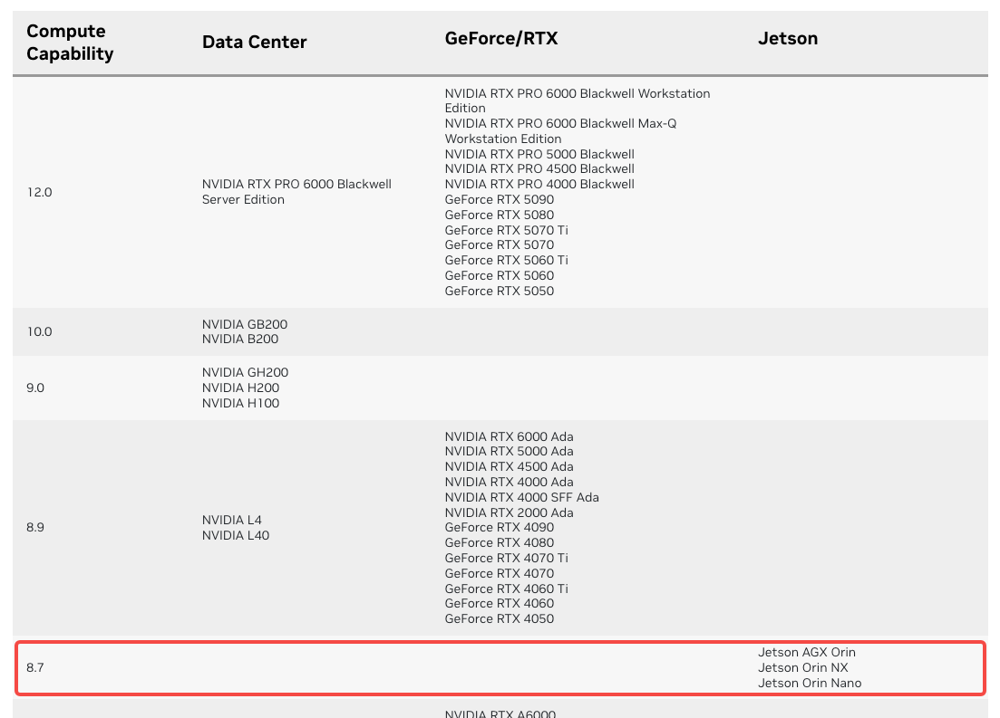
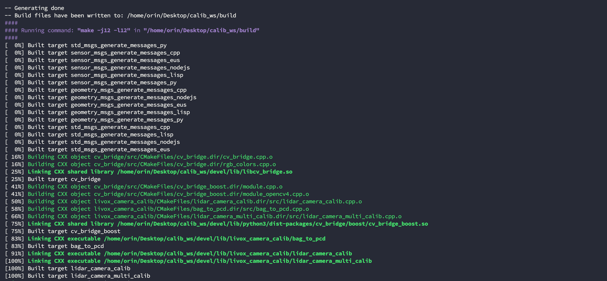
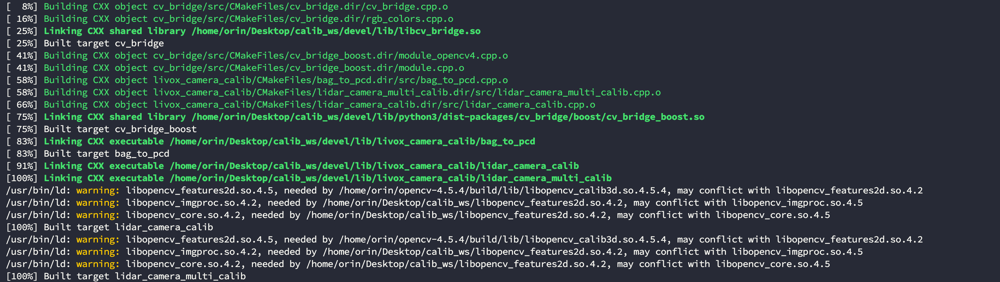
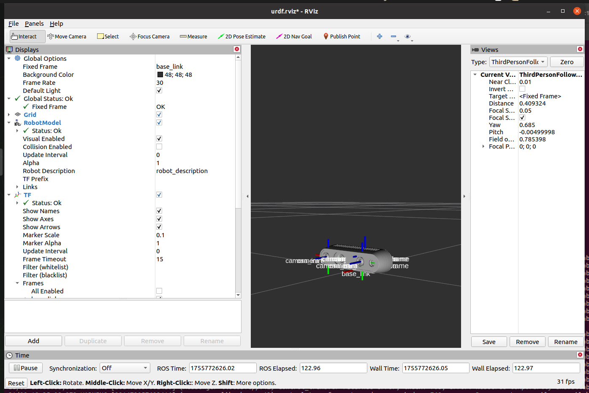
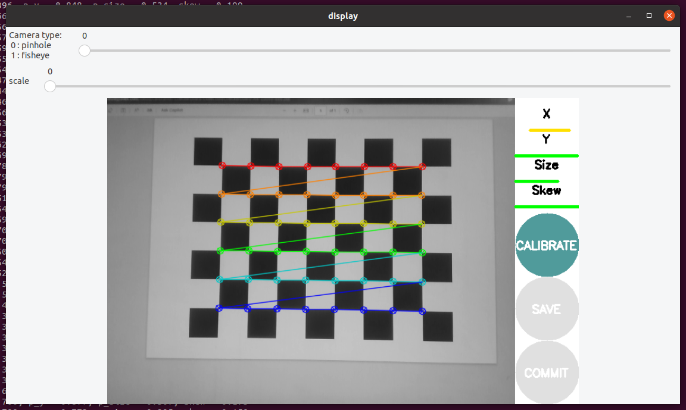
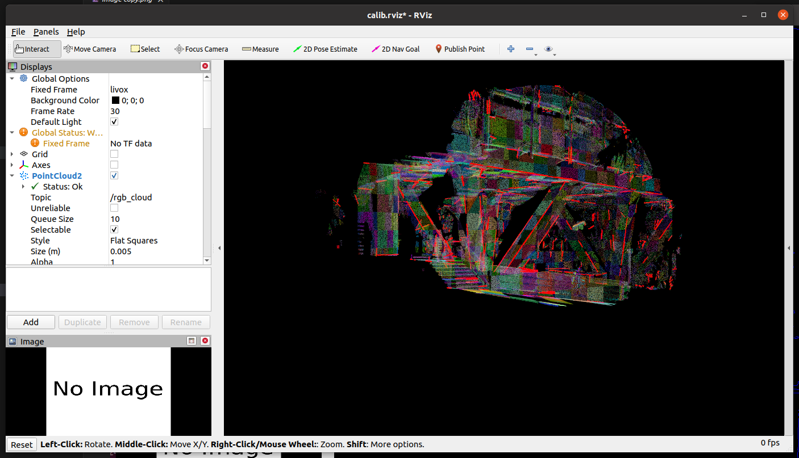
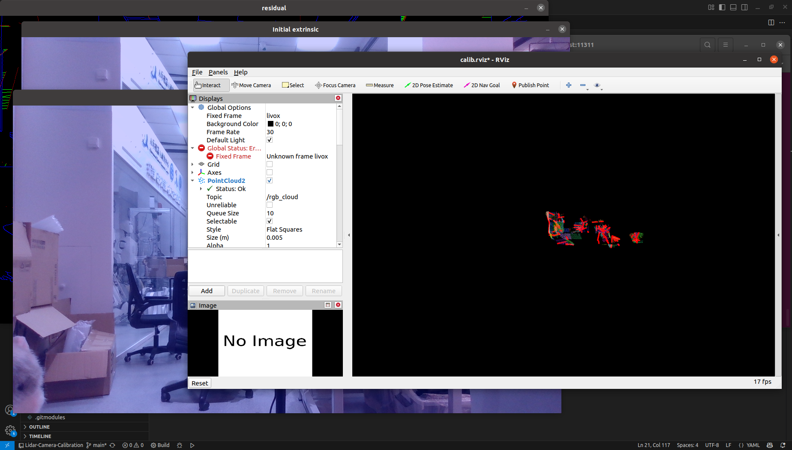

# Lidar Camera Calibration

This repository implements extrinsic calibration of the Mid360 LiDAR and Realsense D435i camera on an Nvidia Jetson device using the livox_camra_calib library. The original repositories involved are as follows:

* livox_camera_calib: [https://github.com/hku-mars/livox_camera_calib#](https://github.com/hku-mars/livox_camera_calib#)
* livox_ros_driver2: [https://github.com/Livox-SDK/livox_ros_driver2.git](https://github.com/Livox-SDK/livox_ros_driver2.git)
* realsense_ros: [https://github.com/IntelRealSense/realsense-ros.git](https://github.com/IntelRealSense/realsense-ros.git)
* vision_opencv: [https://github.com/ros-perception/vision_opencv/tree/noetic#](https://github.com/ros-perception/vision_opencv/tree/noetic#)

Due to the use of the ARM Compiling for the architecture requires some modifications. The source code in this repository has been removed from the original repository's `.git` file to ensure immediate use after downloading. The ReadMe file will explain which parts of the source code have been modified in Section 3.

----

# 1. Confirming the Hardware and Software

We conducted experiments on the following hardware and software devices. If your hardware and software environment differs from ours, we recommend modifying it according to the ReadMe file and replacing the parts relevant to your version.

[Note]: If your device is a Jetson series device and uses Noetic, there are almost no modifications required.

|Device|OS|ROS|
|---|----|---|
|Nvidia Jetson Orin DK|Ubuntu 20.04|Noetic|

Support for more devices will be added after we complete testing.

----

# 2. Install Dependencies

According to the requirements of the [livox_camera_calib](https://github.com/hku-mars/livox_camera_calib) library, you need to install the following dependencies:

## 2.1 ROS Dependencies
```bash
$ sudo apt-get install ros-$ROS_DISTRO-cv-bridge ros-$ROS_DISTRO-pcl-conversions
```
## 2.2 Other Dependencies
You can refer to the installation links provided for other dependencies, but I found that installing Eigen and PCL directly with the following command works without any problems. Only Ceres requires a source code installation:

```bash
$ sudo apt-get install libeigen3-dev libpcl-dev
```

* Eigen: [http://eigen.tuxfamily.org/index.php?title=Main_Page](http://eigen.tuxfamily.org/index.php?title=Main_Page);
* Ceres: [http://ceres-solver.org/installation.html](http://ceres-solver.org/installation.html);
* PCL: [http://www.pointclouds.org/downloads/linux.html](http://www.pointclouds.org/downloads/linux.html)

---

# 3. Pull the Source Code and Compile

Since we need to compile the OpenCV 4.2.0 source code and use the Livox and Realsense ROS drivers, we organized this repository as a completed project and added the required third-party repositories as git submodules.

## 3.1 Pulling the Source Code

Note that you should not pull this repository into the `src` directory of an existing ROS workspace. Instead, create this repository as a separate project. If you need to merge the repository later, you may need to resolve conflicts with packages with the same name.

```bash
$ git clone https://github.com/GaohaoZhou-ops/Lidar-Camera-Calibration.git
```

After pulling the repository, use the following command to initialize the `livox_camera_calib` and `opencv` submodules:

```bash
$ cd Lidar-Camera-Calibration
$ git submodule update --init calib_ws/src/livox_camera_calib/
$ git submodule update --init third_party/opencv-4.2.0/
$ git submodule update --init third_party/opencv-contrib-4.2.0/
$ git submodule update --init third_party/vision_opencv/
```

Switch branches, using version `4.2.0` for opencv and `noetic` for vision_opencv:

```bash
$ cd Lidar-Camera-Calibration
$ cd third_party/opencv-4.2.0/
$ git checkout 4.2.0

$ cd Lidar-Camera-Calibration
$ cd third_party/opencv-contrib-4.2.0/
$ git checkout 4.2.0

$ cd Lidar-Camera-Calibration
$ cd third_party/vision_opencv/
$ git checkout noetic
```

Copy `vision_opencv/cv_bridge` to the `calib_ws/src` directory:

```bash
$ cd Lidar-Camera-Calibration
$ cp -r third_party/vision_opencv/cv_bridge calib_ws/src
```

`livox_ros_driver2` and `realsense_ros` in this project Pull the sub-repository based on your needs. If you have already compiled these two repositories and are using them in another workspace, you can skip the following:

```bash
$ cd Lidar-Camera-Calibration
$ git submodule update --init calib_ws/src/livox_ros_driver2/
$ git submodule update --init calib_ws/src/realsense-ros/
```

## 3.2 Compiling OpenCV 4.2.0

Experimentation revealed that <font color=red>**OpenCV 4.5.4**</font> does not work, but <font color=green>**OpenCV 4.2.0**</font> works.

```bash
$ cd Lidar-Camera-Calibration
$ cd third_party/opencv-4.2.0/
$ mkdir build && cd build
```

Before compiling using the following command, you need to confirm the computing power of your Jetson device:

* For Nvidia computing power, see [https://developer.nvidia.com/cuda-gpus#collapseOne](https://developer.nvidia.com/cuda-gpus#collapseOne)



Modify the fields after `DCUDA_ARCH_BIN` and `DCUDA_ARCH_PTX` below to take full advantage of CUDA acceleration:

```bash
$ cmake \
-DCMAKE_BUILD_TYPE=Release \
-DCMAKE_INSTALL_PREFIX=../install \
-DOPENCV_ENABLE_NONFREE=1 \
-DBUILD_opencv_python2=1 \
-DBUILD_opencv_python3=1 \
-DWITH_FFMPEG=1 \
-DCUDA_TOOLKIT_ROOT_DIR=/usr/local/cuda \
-DCUDA_ARCH_BIN=8.7 \ # Jetson computing power number
-DCUDA_ARCH_PTX=8.7 \ # Jetson computing power account
-DWITH_CUDA=1 \
-DENABLE_FAST_MATH=1 \
-DCUDA_FAST_MATH=1 \
-DWITH_CUBLAS=1 \
-DOPENCV_GENERATE_PKGCONFIG=1 \
-DOPENCV_EXTRA_MODULES_PATH=../../opencv-contrib-4.2.0/modules \
..
```

Then compile using the following command. This process takes about 20 minutes on an Orin DK. Important: Do not run sudo make install after compiling:

```bash
$ make -j ${nproc}
$ make install      # Do NOT use sudo make install
```

## 3.3 Modifying the Source Code
Here, you need to modify the source code at <font color=blue>**4**</font> . The order of modification can be different, but please note that the absolute paths mentioned below must be replaced with your own.

* `calib_ws/src/livox_camera_calib/CMakeLists.txt`:

```cmake
# 1. Set the OpenCV 4.2.0 path

set(OpenCV_DIR "/home/orin/Desktop/Lidar-Camera-Calibration/third_party/opencv-4.2.0/install")
# 2. Add the CUDA toolkit

find_package(CUDAToolkit REQUIRED)

find_package(PCL REQUIRED)
# 3. Specify the OpenCV version

find_package(OpenCV 4.2.0 REQUIRED) # find_package(OpenCV)

find_package(Threads)
# 4. Specify the Ceres version

find_package(Ceres 2.2 REQUIRED) # find_package(Ceres REQUIRED)
```

* `calib_ws/src/cv_bridge/CMakeLists.txt`:
```cmake
set(OpenCV_DIR "/home/orin/Desktop/Lidar-Camera-Calibration/third_party/opencv-4.2.0/install")
find_package(OpenCV 4.2.0 QUIET)
# set(_opencv_version 4)
# find_package(OpenCV 4 QUIET)
```

* `calib_ws/src/livox_camera_calib/src/lidar_camera_calib.cpp`
```cpp
// ceres::LocalParameterization *q_parameterization =
// new ceres::EigenQuaternionParameterization();
ceres::Manifold *q_parameterization = new ceres::EigenQuaternionManifold();
```

* `calib_ws/src/livox_camera_calib/src/lidar_camera_multi_calib.cpp`
```cpp
// ceres::LocalParameterization *q_parameterization =
// new ceres::EigenQuaternionParameterization();
ceres::Manifold *q_parameterization = new ceres::EigenQuaternionManifold();
```

After completing the above source code modifications, we also provide a script for cropping the Livox raw point cloud. This is intended to reduce the point cloud range when collecting rosbags, avoiding excessive PNP computation overhead later. The launch file limits the XYZ range.

```bash
$ cd Lidar-Camera-Calibration
$ mkdir calib_ws/src/livox_camera_calib/scripts
```

Copy `collect_data.launch` and `collect_data.py` files：
```bash
$ cp resources/source_code/collect_data.py calib_ws/src/livox_camera_calib/scripts

$ cp resources/source_code/collect_data.launch calib_ws/src/livox_camera_calib/launch

$ chmod 777 calib_ws/src/livox_camera_calib/scripts/*
```

## 3.4 Compiling the Project
After modifying the source code above, you can compile the entire project. If you have already activated the conda environment and have not made any additional configuration, it is recommended to exit the conda environment first.

```bash
$ cd Lidar-Camera-Calibration
$ cd calib_ws
$ conda deactivate
$ catkin_make
```



If you do not follow the above steps, especially those related to OpenCV, you may see the following warning. Do not ignore this warning, or the program will crash upon startup:

```bash
/usr/bin/ld: warning: libopencv_features2d.so.4.5, needed by /home/orin/opencv-4.5.4/build/lib/libopencv_calib3d.so.4.5.4, may conflict with libopencv_features2d.so.4.2
/usr/bin/ld: warning: libopencv_imgproc.so.4.2, needed by /home/orin/Desktop/calib_ws/libopencv_features2d.so.4.2, may conflict with libopencv_imgproc.so.4.5
/usr/bin/ld: warning: libopencv_core.so.4.2, needed by /home/orin/Desktop/calib_ws/libopencv_features2d.so.4.2, may conflict with libopencv_core.so.4.5
[100%] Built target lidar_camera_calib
/usr/bin/ld: warning: libopencv_features2d.so.4.5, needed by /home/orin/opencv-4.5.4/build/lib/libopencv_calib3d.so.4.5.4, may conflict with libopencv_features2d.so.4.2
/usr/bin/ld: warning: libopencv_imgproc.so.4.2, needed by /home/orin/Desktop/calib_ws/libopencv_features2d.so.4.2, may conflict with libopencv_imgproc.so.4.5
/usr/bin/ld: warning: libopencv_core.so.4.2, needed by /home/orin/Desktop/calib_ws/libopencv_features2d.so.4.2, may conflict with libopencv_core.so.4.5
```



----

# 4. Configuring the Project
This section also requires some source code modifications, but does not involve compiling. It is recommended to run the official demo before running your own application. Related resource links are as follows:

* Official demo data: [https://pan.baidu.com/s/1oz3unqsmDnFvBExY5fiBJQ?pwd=i964](https://pan.baidu.com/s/1oz3unqsmDnFvBExY5fiBJQ?pwd=i964)

## 4.1 Obtaining Camera Intrinsic Parameters
Camera intrinsic parameters will be frequently used during the calibration process. Obtaining them is a very basic operation. Two methods are provided here.

### 4.1.1 Direct Obtaining
If your device is a RealSense D435i or another mass-produced series, the easiest way is to view the camera intrinsic parameters through the driver. For information on installing the RealSense SDK and ROS project, please refer to my flashing blog post; I will not elaborate on this here.

Note: Since the `realsense-ros` repository is not pulled in the current workspace, I assume you have already pulled it and compiled it in another workspace named `realsense_ws`.

```bash
$ cd realsense_ws
$ source devel/setup.bash
$ roslaunch realsense2_camera rs_d435_camera_with_model.launch
```



Then view the contents of the topic `/camera/color/camera_info`. The information in the topic means the following:

* `K`: Camera intrinsic parameter matrix camera_matrix (what we need);
* `D`: Distortion coefficients dist_coeffs;
* `R`: Rotation matrix rotate_matrix;
* `P`: Projection matrix project_matrix;

```bash
rostopic echo /camera/color/camera_info

height: 480
width: 640
distortion_model: "plumb_bob"
D: [0.0, 0.0, 0.0, 0.0, 0.0]
K: [607.2879028320312, 0.0, 322.6806640625, 0.0, 606.75830078125, 250.453369140625, 0.0, 0.0, 1.0]
R: [1.0, 0.0, 0.0, 0.0, 1.0, 0.0, 0.0, 0.0, 1.0]
P: [607.2879028320312, 0.0, 322.6806640625, 0.0, 0.0, 606.75830078125, 250.453369140625, 0.0, 0.0, 0.0, 1.0, 0.0]
binning_x: 0
binning_y: 0
roi:
x_offset: 0
y_offset: 0
height: 0
width: 0
do_rectify: False
```

### 4.1.2 Internal Calibration
If your camera doesn't support direct calibration, you'll need to use the calibration tool. First, install the dependencies:

```bash
$ sudo apt-get install ros-$ROS_DISTRO-camera-calibration
```

Then start the calibration tool and prepare a checkerboard calibration board. You can generate one directly from the following website:

* [https://markhedleyjones.com/projects/calibration-checkerboard-collection](https://markhedleyjones.com/projects/calibration-checkerboard-collection)

Here, we'll still use the Realsense D435i device as an example. The command parameters below have the following meanings:

* `--size 8x6`: The number of checkerboard corner points. This directly represents 9 black and white squares horizontally and 7 black and white squares vertically.
* `--square`: The size of a single checkerboard square, in meters.
* `image`: The topic name to publish the image to.

```bash
$ rosrun camera_calibration cameracalibrator.py --size 8x6 --square 0.024 image:=/camera/color/image_raw
```

Move the camera to view the checkerboard from different angles and distances until the `CALIBRATE` button turns green, then click to start the calculation:

* `X`: Left and right movement;
* `Y`: Up and down movement;
* `Size`: Forward and backward movement;
* `Skew`: Skew rotation;



Calculating the internal parameters may take a while. After the calculation is complete, you should see the following output in the terminal:

```bash
camera matrix
608.970206 0.000000 309.853058
0.000000 604.838795 257.667687
0.000000 0.000000 1.000000

distortion
0.145507 -0.252373 0.006365 -0.011785 0.000000

rectification
1.000000 0.000000 0.000000
0.000000 1.000000 0.000000
0.000000 0.000000 1.000000

projection
621.799255 0.000000 302.949580 0.000000
0.000000 621.586121 259.744721 0.000000
0.000000 0.000000 1.000000 0.000000
```

## 4.2 Single Sensor Demo
Modify the configuration file `src/livox_camera_calib/config/calib.yaml` and replace the paths and camera parameter matrices with your own. If you are running the demo, you do not need to modify the camera parameter matrix:

```yaml
# Data path. Adjust them!
common:
image_file: "/home/orin/Desktop/calib_ws/dataset/single_scene_calibration/0.png"
pcd_file: "/home/orin/Desktop/calib_ws/dataset/single_scene_calibration/0.pcd"
result_file: "/home/orin/Desktop/calib_ws/src/livox_camera_calib/result/extrinsic.txt"

# Camera Parameters. Adjust them!
camera: 
camera_matrix: [1364.45, 0.0, 958.327, 
0.0, 1366.46, 535.074, 
0.0, 0.0, 1.0 ] 
dist_coeffs: [0.0958277, -0.198233, -0.000147133, -0.000430056, 0.000000]

# Calibration Parameters.!
calib: 
calib_config_file: "/home/orin/Desktop/calib_ws/src/livox_camera_calib/config/config_outdoor.yaml"
use_rough_calib: true # set true if your initial_extrinsic is bad
```

Run the following program in the terminal. The time required will vary depending on your hardware configuration, but it's normal for the RVIZ screen to be completely black upon startup, as feature and residual calculations have not yet begun:

```bash
$ cd calib_ws
$ source devel/setup.bash
$ roslaunch livox_camera_calib calib.launch
```

The program will pop up five windows in sequence, and the final feature matching results will be displayed in RVIZ:



After the final calculation is complete, the following output will be displayed in the terminal. This calculation is very resource-intensive and takes about 5 minutes. `push enter to publish again` will appear. The prompt indicates that the calibration is complete:

```bash
q_dis:0.00483663, t_dis:0.00348196
Iteration:39 Dis:11 pnp size:12172
iter cost cost_change |gradient| |step| tr_ratio tr_radius ls_iter iter_time total_time
0 5.418889e+04 0.00e+00 2.20e+04 0.00e+00 0.00e+00 1.00e+04 0 1.99e+00 2.00e+00
1 5.415701e+04 3.19e+01 1.96e+01 0.00e+00 1.00e+00 3.00e+04 1 2.09e+00 4.09e+00
Ceres Solver Report: Iterations: 2, Initial cost: 5.418889e+04, Final cost: 5.415701e+04, Termination: CONVERGENCE
q_dis: 0.00837903 , t_dis: 0.00304098
Push enter to publish again

```


The calibration results will be saved to `calib_ws/src/livox_camera_calib/result/extrinsic.txt` In the file:
```txt
-0.00265775,-0.999901,-0.0138502,0.0146354
-0.00333279,0.013859,-0.999898,0.0573609
0.999991,-0.00261132,-0.00336929,-0.0519612
0,0,0,1
```

## 4.3 Single Sensor Pair - Real Device

This project requires a rosbag data package and an image captured by an RGB camera. When capturing images, please note the following:

1. The radar and camera must not be moving during acquisition;
2. The captured object must be a stationary object;
3. The larger the scale, the better.
4. The radar and camera should ideally be facing the object.

Because Mid360 covers a 360-degree horizontal plane and the calibration tool solves a point-in-none (PNP) problem, it's best to reduce the amount of data required for computation. The most practical and simple approach is to subscribe to the radar point cloud topic and limit its crop box. We provide a node script that subscribes to the raw point cloud topic and retains only points within a certain angle. This step is optional, but we've found that limiting the crop box improves calibration performance. Use the provided script to collect approximately 3 seconds of data:

```bash
$ roslaunch livox_camera_calib collect_data.launch
```

If you receive the following error `undefined symbol: ffi_type_pointer` after running, execute the following command:

```bash
$ conda install libffi==3.3
$ pip install numpy==1.24.0
```

The generated data will be saved in the `calib_ws/src/livox_camera_calib/output` directory:

```bash
.
├── capture_20250902_210451.png
└── capture_20250902_210453.pcd
```

Then modify the configuration file `calib_ws/src/livox_camera_calib/config/calib.yaml` to specify the file path, but pay special attention to the following: For the `calib/calib_config_file` parameter, use `config_indoor.yaml` for indoor use and `config_outdoor.yaml` for outdoor use:

```yaml
# Data path. Adjust them!
common:
image_file: "/home/orin/Desktop/Lidar-Camera-Calibration/calib_ws/src/livox_camera_calib/output/capture_20250902_210451.png"
pcd_file: "/home/orin/Desktop/Lidar-Camera-Calibration/calib_ws/src/livox_camera_calib/output/capture_20250902_210453.pcd"
result_file: "/home/orin/Desktop/Lidar-Camera-Calibration/offical_demo/extrinsic.txt"

# Camera Parameters. Adjust them!
camera: 
camera_matrix: [1364.45, 0.0, 958.327, 
0.0, 1366.46, 535.074, 
0.0, 0.0, 1.0 ] 
dist_coeffs: [0.0958277, -0.198233, -0.000147133, -0.000430056, 0.000000]

# Calibration Parameters.!
calib: 
calib_config_file: "/home/orin/Desktop/Lidar-Camera-Calibration/calib_ws/src/livox_camera_calib/config/config_indoor.yaml" 
use_rough_calib: true # set true if your initial_extrinsic is bad
```


